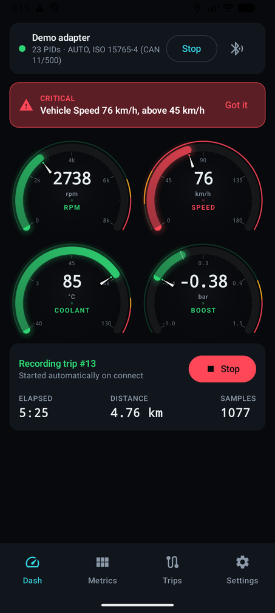
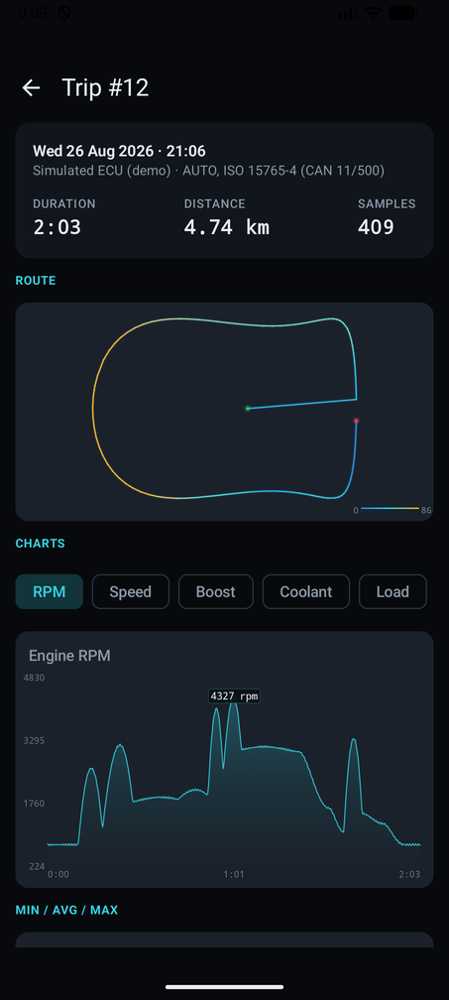
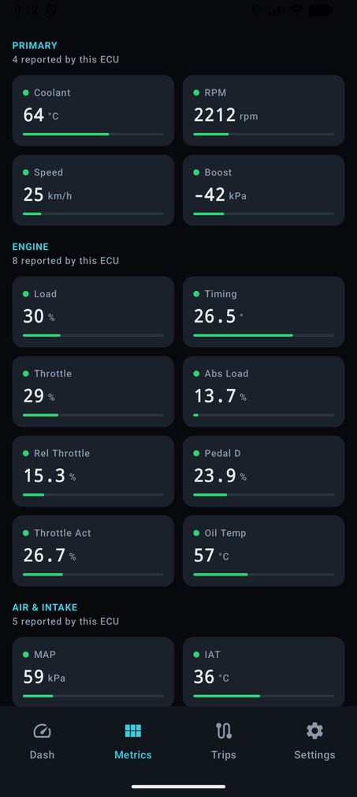
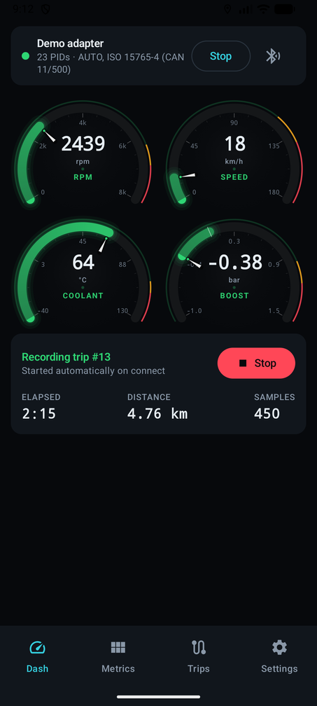
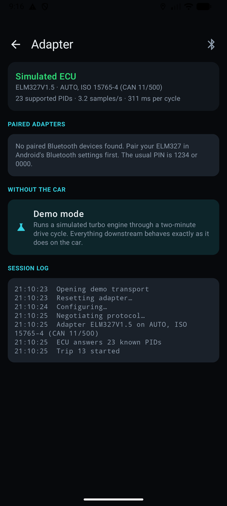
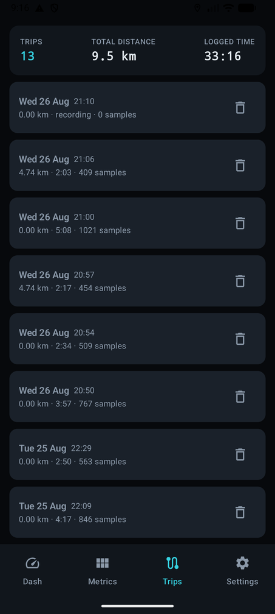
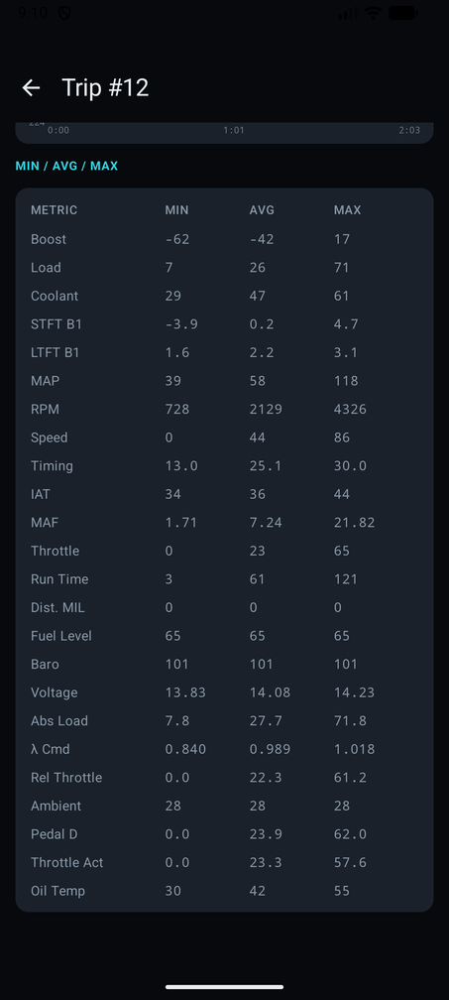
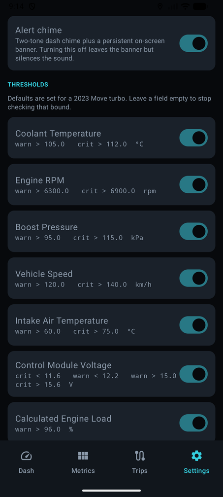
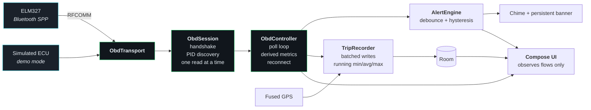

<div align="center">

# OBD2 Dash

**A live engine dashboard and trip logger for my Daihatsu Move turbo, over a £12 ELM327 adapter.**

[](https://kotlinlang.org)
[](https://developer.android.com/jetpack/compose)
[](https://developer.android.com)
[](https://developer.android.com/training/data-storage/room)
[](#testing)
[](LICENSE)





</div>

---

## What this is

My car has a 660cc turbo engine and a dashboard that tells me almost nothing about it. This app plugs
that gap. It talks to a cheap ELM327 Bluetooth adapter in the OBD2 port, polls the ECU a few times a
second, and puts the four numbers I actually care about on screen in a size I can read from the
passenger seat.

It also records every drive. When a trip ends you get charts, a GPS route, and min/avg/max for every
sensor the ECU was willing to talk about.

**Boost is the reason this exists.** No ECU reports boost directly, so the app computes it as
`MAP - barometric pressure`. Positive is boost, negative is vacuum off throttle. On a small turbo
that single number tells you more than the rest of the dashboard combined.

## Highlights

|  | |
|---|---|
| **Runs without the car** | A built-in simulated ECU drives a two-minute cycle so the whole app works on your desk. Details [below](#running-without-the-car). |
| **Nothing hardcoded per ECU** | Supported PIDs are discovered at connect time from the `0100` / `0120` / `0140` bitmasks. 60+ Mode 01 parameters decodable. |
| **Alerts that do not flap** | A breach must hold for three samples before it fires, and must recover past a hysteresis margin before it clears. |
| **Trips survive the glovebox** | A foreground service keeps logging through screen off and app backgrounding. Trips left open by a crash are closed on next launch. |
| **Everything hand drawn** | Gauges, charts and the route trace are Compose canvas. No charting library, no Maps API key. |
| **The route is the data** | The GPS track is coloured by speed, so where you pressed on shows up without reading a chart. |

## Screens

<table>
  <tr>
    <td align="center"><b>Live dashboard</b></td>
    <td align="center"><b>All metrics</b></td>
    <td align="center"><b>Adapter</b></td>
  </tr>
  <tr>
    <td></td>
    <td></td>
    <td></td>
  </tr>
  <tr>
    <td>Redline printed outside the track, a bloom on the lit arc, tapered pointer. Boost fills from zero, so vacuum reads one way and boost the other.</td>
    <td>Every other PID the ECU answers, grouped, with a staleness dim on the slow tier.</td>
    <td>Pick a paired adapter, watch the handshake, see the achieved sample rate.</td>
  </tr>
  <tr>
    <td align="center"><b>Trip history</b></td>
    <td align="center"><b>Trip report</b></td>
    <td align="center"><b>Thresholds</b></td>
  </tr>
  <tr>
    <td></td>
    <td></td>
    <td></td>
  </tr>
  <tr>
    <td>Every drive, kept indefinitely.</td>
    <td>Scrubbable charts with the peak marked, plus min/avg/max for everything logged.</td>
    <td>Defaults tuned for the KF-VET. Edit any bound, leave one blank to stop checking it.</td>
  </tr>
</table>

## How it fits together



`ObdController` is the single owner of anything live. Screens observe its flows and hold no
connection state of their own, which is why rotating the phone or backgrounding the app never
interrupts a trip.

## The interesting part: budgeting the poll loop

An ELM327 is a single serial device. One request, one reply, roughly 40 to 70 ms each over RFCOMM.
You cannot ask for twenty parameters at 5 Hz, so the loop spends its budget deliberately:

| Tier | Contents | Rate |
|---|---|---|
| **Fast** | RPM, speed, MAP, throttle, engine load | every cycle |
| **Slow** | everything else the ECU supports | one per cycle, round robin |
| **Rare** | barometric, fuel level, odometer counters | one every 60 s |

Barometric pressure tracks the weather, not your right foot, so polling it at 3 Hz would be pure
waste. It gets read once at connect and refreshed on a timer, which leaves the sample rate for the
metrics that actually move.

Measured on device, with the frame-count hint enabled: **254 ms per cycle, 3.9 samples/s.** A PID
that is advertised in the support bitmask but answers `NO DATA` three times gets dropped from the
rotation for the rest of the session.

## Running without the car

Settings → Demo mode, or pick **Demo mode** on the Adapter screen.

`SimulatedObdTransport` impersonates an ELM327 sitting in front of a 660cc turbo running a repeating
two-minute cycle: idle, pull away, cruise, an overtake, then back to a stop. Throttle, boost, MAF,
coolant warm-up and ignition timing are all derived from one speed curve, so the readings stay
physically consistent with each other rather than being independently faked.

It sits at the transport seam, which means **everything above it is the production code path**:
handshake, PID scan, polling, boost maths, alerts, trip recording, charts. A trip logged in demo mode
is indistinguishable from a real one apart from the GPS track.

## Getting started

```bash
git clone https://github.com/M0hid-ai/obd2-dash.git
cd obd2-dash
./gradlew installDebug
```

Then pair your ELM327 in Android's Bluetooth settings first (the usual PIN is `1234` or `0000`) and
pick it on the Adapter screen.

```bash
./gradlew testDebugUnitTest   # 41 JVM tests, no device needed
./gradlew assembleDebug       # APK only
```

<details>
<summary><b>If Gradle complains about your JDK</b></summary>

<br>

Gradle 8.14 and AGP 8.11.1 do not accept JDK 24 or newer. Android Studio's bundled runtime works
fine, so point `JAVA_HOME` at it:

```bash
JAVA_HOME="C:/Program Files/Android/Android Studio/jbr" ./gradlew assembleDebug
```

Building from inside Android Studio needs no setup, it picks that JDK up on its own.

</details>

<details>
<summary><b>Why the dependency versions look a year old</b></summary>

<br>

They are pinned on purpose. Current AndroidX releases require AGP 9.1+ and `compileSdk 37`. This
project targets `compileSdk 36` on AGP 8.11.1, which is the newest combination that builds against
it. Bumping AndroidX means installing platform 37 and moving to AGP 9 first, in that order.

</details>

## Layout

```
obd/
  ObdPid.kt          PID registry: command, units, display range, decoder for each
  ObdProtocol.kt     Reply sanitising, support bitmasks, DTC decoding
  ObdSession.kt      AT handshake, PID discovery, one read at a time
  ObdController.kt   Owns the connection, runs the poll loop
  transport/         BluetoothObdTransport (RFCOMM/SPP) and the simulator

data/
  db/                Room entities and DAOs
  TripRecorder.kt    Batched sample writes, running aggregates, trip finalise
  TripRepository.kt  History, chart series, route
  SettingsStore.kt   DataStore preferences and thresholds

alerts/              Threshold rules, debounce/hysteresis engine, notifications
location/            Fused GPS and distance accumulation
service/             Foreground service so a trip survives screen off
ui/                  Compose screens, hand drawn gauges and charts
```

Dependency injection is a hand written `AppGraph`. The app is one module with a single long lived
object that matters, so a DI framework would cost build time and an annotation processor without
buying anything back. Room's KSP processor is the only one in the build.

## Design decisions worth explaining

<details>
<summary><b>Why alerts need hysteresis</b></summary>

<br>

A banner that blinks on and off at the threshold boundary is worse than useless to someone driving.
Two guards stop that:

- a breach must persist for **three consecutive samples** before anything is raised, so one corrupt
  frame is ignored
- a raised alert only clears once the value comes back inside its bound by **2% of the metric's
  range**, not the instant it grazes the line

Escalating from warning to critical counts as a new event: it sounds again and clears the
acknowledgement. Dropping back down does not.

</details>

<details>
<summary><b>Why readings are stored the way they are</b></summary>

<br>

The four gauge metrics plus GPS get real columns, because charts, the route map and the summary all
query them directly. Every other PID is packed into one `key=value;` string in the same row.

That keeps a half hour trip at roughly 5,000 rows instead of 100,000, and means adding a new PID
never needs a schema migration. Trip summaries are kept indefinitely; the raw samples are the bulk of
the database and have a retention hook waiting for a policy.

</details>

<details>
<summary><b>Why there is no Google Maps</b></summary>

<br>

A basemap needs an API key checked into the project and a network round trip to display a route the
phone already recorded. The shape of the drive is the useful part, so the route is drawn on a canvas,
with latitude corrected for longitude convergence so it is not stretched east to west.

It is also coloured by speed, which is the thing a basemap cannot give you. A grey line on a map tells
you where you went; a track that runs cool through the roundabouts and warm down the straight tells
you how you drove there.

One wrinkle worth knowing about: a phone hands out its stale last known position until the first real
fix lands, and that can be hundreds of kilometres away. Those points are rejected before they are
stored, and the renderer additionally keeps only the longest unbroken run of the track, so an old trip
carrying a teleport still draws correctly.

Swap `RouteTrace` for a Maps composable if you ever want the real thing underneath.

</details>

<details>
<summary><b>Why the alert chime is synthesised</b></summary>

<br>

A short two-tone dash bell, generated as a WAV rather than pulled from a sample library, so there is
no third party licence to track in a repo I want to keep MIT. The generator lives in the commit
history if you want to retune it; the output sits in `res/raw`.

Deliberately not text to speech. Speech is slow to parse and easy to talk over.

</details>

## Testing

41 JVM tests, no device required. They concentrate on the places where a bug is silent, because a
wrong decoder does not crash, it just shows you a plausible number that happens to be false.

- reply sanitising: embedded spaces, `SEARCHING...` notices, multi-frame counters, truncated frames
- every PID decoder against known byte values
- support bitmask bit ordering, including the block-continuation bit
- DTC decoding both with and without the count byte that CAN ECUs prepend
- alert debounce, hysteresis, escalation and de-escalation
- a full `ObdSession` handshake, PID scan and read against the simulator

The UI has no instrumented tests. It was verified by running it.

## Roadmap

- [x] Bluetooth SPP connection and ELM327 handshake
- [x] Runtime PID discovery
- [x] Four gauge dashboard with threshold colour bands
- [x] All metrics screen
- [x] Room trip logging, automatic and manual start/stop
- [x] Threshold alerts, chime plus persistent banner
- [x] Trip reports with charts and route
- [x] Editable thresholds and settings
- [ ] Firestore batch upload after each trip
- [ ] Web dashboard reading from Firestore
- [ ] Retention policy for raw reading rows

Firestore sync is scaffolded but not wired up: it needs a `google-services.json` that is specific to
your Firebase project. `TripEntity.syncedAt` and `TripDao.pendingUpload()` are already there for it.

## Hardware

| | |
|---|---|
| Adapter | ELM327 Mini, Bluetooth Classic (SPP, not BLE) |
| Vehicle | Daihatsu Move 2023, turbo (KF-VET, 660cc, CVT) |
| Protocol | ISO 15765-4 CAN 11 bit / 500 kbaud, auto detected |
| Phone | Android 8.0 or newer |

The [PID reference](docs/PID-REFERENCE.md) lists what the app decodes and what this car actually
reports.

## License

MIT. See [LICENSE](LICENSE).
