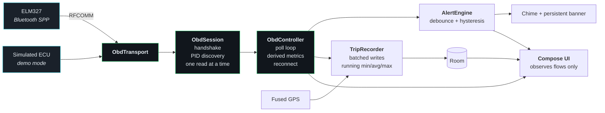

<div align="center">

# OBD2 Dash

**A live engine dashboard and trip logger for any OBD2 car, over a cheap ELM327 Bluetooth adapter.**

[](https://kotlinlang.org)
[](https://developer.android.com/jetpack/compose)
[](https://developer.android.com)
[](https://developer.android.com/training/data-storage/room)
[](#testing)
[](LICENSE)


</div>

---

## What this is

Most cars have a dashboard that tells you almost nothing about the engine underneath it. This app
plugs that gap. It talks to a cheap ELM327 Bluetooth adapter in the OBD2 port, polls the ECU a few
times a second, and puts the numbers that matter on screen in a size you can read at a glance.

It also records every drive. When a trip ends you get charts, a GPS route, and min/avg/max for every
sensor the ECU was willing to talk about — plus the trouble codes your dashboard warning lamp does
not show you.

**Boost gets special treatment.** No ECU reports it directly, so the app computes it as
`MAP - barometric pressure`. Positive is boost, negative is vacuum off throttle. On a turbocharged
car that single number tells you more than the rest of the dashboard combined; on a naturally
aspirated one the same dial rescales itself to show manifold vacuum instead.

## Stack

Native Android. No C, no Python, no cross-platform runtime — this is a Kotlin app compiled to an APK.

| Layer | What it is |
|---|---|
| **Language** | Kotlin 2.2.10, JVM target 17 |
| **UI** | Jetpack Compose (Material 3). Every gauge, chart and the route trace is hand-drawn on a Compose `Canvas` — no charting library, no Maps SDK |
| **Async** | Kotlin coroutines and `StateFlow`. The poll loop is a coroutine; screens observe flows and own no connection state |
| **Storage** | Room (SQLite) for trips and samples, DataStore for preferences and thresholds |
| **Transport** | `BluetoothSocket` over RFCOMM/SPP, straight to the ELM327. No third-party OBD library — the AT handshake and every PID decoder are in this repo |
| **Build** | Gradle 8.14 with AGP 8.11.1, KSP for Room. Single module |
| **Testing** | JUnit 4 on the JVM, 61 tests, no device needed |
| **Dependency injection** | A hand-written `AppGraph`. One module with one long-lived object, so a framework would cost build time and an annotation processor without buying anything back |

Third-party runtime dependencies are AndroidX plus Play Services Location. That is the whole list.

## What it works with

Short answer: **any OBD2-compliant vehicle**, which in practice means almost anything sold after the
mid-2000s. It is not magic, though, so here is the honest boundary.

**Works**

| | |
|---|---|
| **Vehicles** | Any car that implements OBD2 / EOBD / JOBD. Mandatory in the US from 1996, the EU from 2001 (petrol) and 2004 (diesel), and most other markets by around 2008 |
| **Engines** | Petrol and diesel, naturally aspirated or forced induction. The app works out which from the data rather than from a setting |
| **Hybrids** | The normal engine parameters work whenever the engine is running |
| **Adapters** | ELM327 clones over Bluetooth Classic (SPP), v1.3 and up. The cheap ones are fine — there is a fallback for the malformed SDP records they often ship with |
| **Phones** | Android 8.0 (API 26) and newer |

**Does not work**

| | |
|---|---|
| **BLE-only adapters** | This app speaks Bluetooth Classic SPP. Adapters advertising "Bluetooth 4.0 / BLE" use a completely different, and usually undocumented, protocol |
| **Wi-Fi or USB adapters** | Same reason. Both are plausible additions behind the existing `ObdTransport` interface, but neither is written |
| **Manufacturer-specific data** | Only the generic SAE parameters are decoded. Things like gearbox oil temperature or per-wheel tyre pressure usually live in a carmaker's own PID range and mean different things on different marques |
| **EV traction batteries** | State of charge, cell voltages and pack temperature are all manufacturer-specific. A pure EV will connect and report very little |
| **Pre-OBD2 cars** | No standard to speak to |
| **iOS** | Bluetooth Classic SPP is not available to third-party iOS apps |

The parts that genuinely adapt themselves, with no per-vehicle configuration anywhere in the repo,
are [described below](#fitting-itself-to-whatever-is-plugged-in). What it cannot do is invent data an
ECU does not publish: a car that answers twelve parameters gets twelve cards, not sixty.

## Highlights

|  | |
|---|---|
| **Runs without the car** | A built-in simulated ECU drives a two-minute cycle so the whole app works on your desk. Details [below](#running-without-the-car). |
| **Nothing hardcoded per ECU** | Supported PIDs are discovered at connect time from the `0100` / `0120` / `0140` bitmasks. 60+ Mode 01 parameters decodable. |
| **Alerts that do not flap** | A breach must hold for 600ms of wall clock time before it fires, and must recover past a hysteresis margin before it clears. Measured in time rather than a sample count, because the real cycle time moves depending on how fast the adapter answers. |
| **Trips survive the glovebox** | A foreground service keeps logging through screen off and app backgrounding. Trips left open by a crash are closed on next launch. |
| **Knows when the engine stops** | The adapter is powered from OBD pin 16, so it stays alive with the car locked and a Bluetooth drop never means "engine off". Engine state is read from RPM instead. |
| **Everything hand drawn** | Gauges, charts and the route trace are Compose canvas. No charting library, no Maps API key. |
| **The route is the data** | The GPS track is coloured by speed, so where you pressed on shows up without reading a chart. |
| **Nine gauge faces, one accent colour** | Hexa, Heritage in four bezel finishes, Cockpit, Circuit, or the original. Recolour the healthy band to taste, or leave the skin on Compare all and judge them side by side against live data. |
| **Built to be glanced at, not read** | A push-start button for trip recording and a segmented shift light bar across the top of the screen. |
| **Finds the faults your dash hides** | The warning lamp only ever reflects *confirmed* codes. Pending codes (Mode 07) and permanent codes (Mode 0A) light nothing and are not counted by PID 0101, so both are read unconditionally, alongside the readiness monitors that reveal a recent code clear. |
| **Sends a trip as one file** | Export any finished trip as a self-contained HTML report: tables, vector charts and the route in a single attachment with **no images at all**, or as raw CSV for a spreadsheet. |
| **Fits itself to the car** | The dial scale, the boost/vacuum split, the protocol and how much of the PID list fits in a cycle are all decided from what the car actually answers. |

## Screens

<table>
  <tr>
    <td align="center"><b>Live dashboard</b></td>
    <td align="center"><b>All metrics</b></td>
    <td align="center"><b>Adapter</b></td>
  </tr>
  <tr>
    <td></td>
    <td></td>
    <td></td>
  </tr>
  <tr>
    <td>Redline printed outside the track, a bloom on the lit arc, tapered pointer. Boost fills from zero, so vacuum reads one way and boost the other.</td>
    <td>Every other PID the ECU answers, grouped, with a staleness dim on the slow tier. Trouble codes and emissions self-tests sit above them.</td>
    <td>Pick a paired adapter, watch the handshake, see the achieved sample rate.</td>
  </tr>
  <tr>
    <td align="center"><b>Trip history</b></td>
    <td align="center"><b>Trip report</b></td>
    <td align="center"><b>Thresholds</b></td>
  </tr>
  <tr>
    <td></td>
    <td></td>
    <td></td>
  </tr>
  <tr>
    <td>Every drive, kept indefinitely.</td>
    <td>Scrubbable charts with the peak marked, plus min/avg/max for everything logged. Exports from here.</td>
    <td>Conservative generic OBD2 defaults. Edit any bound, leave one blank to stop checking it.</td>
  </tr>
</table>

## Gauge faces

The four main dials are not one drawing recoloured over and over. Each face disagrees about sweep
angle, needle length, whether there is a needle at all, and where the number sits, because that is
what actually makes two dials read as different instruments rather than the same instrument in a
different paint scheme.

| Face | Modelled on | What's different |
|---|---|---|
| Original | — | The dial this app shipped with: thick lit track, redline printed outside it, short blade needle. |
| Hexa | Lamborghini Aventador cluster | Hexagonal bezel, wedge graduations that taper inward, hard edged sweep with no rounded caps anywhere. |
| Heritage — Steel | Porsche 911 five dial cluster | Brushed metal bezel, numerals printed on a black face, full length needle with a counterweight. |
| Heritage — Gunmetal | same, dark finish | Same traditional dial, dark and almost matte instead of shiny. |
| Heritage — Titanium | same, cool finish | Same dial again, cooler and lighter with a faint blue cast. |
| Heritage — Carbon | same, woven finish | Same dial with a woven carbon fibre bezel under a glossy clear coat. |
| Cockpit | Audi virtual cockpit | One hairline ring, a puck for a pointer, a very large number. Everything that is not information is gone. |
| Circuit | GT-R and race car shift displays | A segmented shift bar bent into an arc, with a peak hold marker that catches a spike before you could look down and see it. |

Pick a favourite in Settings, or leave it on **Compare all** and it hands out a different face per
dial, paired to the metric it suits: Hexa on the tachometer, Heritage on road speed, Cockpit on
coolant, Circuit on boost.

A healthy-band accent colour sits alongside the face picker. It only recolours the "everything is
fine" band, deliberately: warning stays amber and danger stays red regardless of what is picked, so
the alert colour coding never changes meaning just because the theme did.

## How it fits together



`ObdController` is the single owner of anything live. Screens observe its flows and hold no
connection state of their own, which is why rotating the phone or backgrounding the app never
interrupts a trip.

## The interesting part: budgeting the poll loop

An ELM327 is a single serial device. One request, one reply, roughly 40 to 70 ms each over RFCOMM.
You cannot ask for twenty parameters at 5 Hz, so the loop spends its budget deliberately:

| Tier | Contents | Rate |
|---|---|---|
| **Fast** | RPM, speed, MAP | every cycle |
| **Slow** | everything else the ECU supports, including throttle and engine load | round robin, as many as the cycle budget allows |
| **Rare** | barometric, fuel level, odometer and MIL counters | one every 60 s |

Barometric pressure tracks the weather, not your right foot, so polling it at 3 Hz would be pure
waste. It gets read once at connect and refreshed on a timer, which leaves the sample rate for the
metrics that actually move.

Throttle and engine load used to sit in the fast tier too. Neither drives a gauge or a time-critical
alert, and each one is a full request-response round trip added to every cycle. Moving them to the
slow rotation bought back two reads per cycle for free.

The slow tier used to read exactly **one** PID per cycle, which quietly wasted most of the budget on
a quick link. A car answering 35 parameters needed half a minute to refresh them all, and it showed:
the slow-tier charts in a trip report came out as visible staircases rather than curves. The loop now
measures what a round trip actually costs, as a rolling average, and fits as many slow reads into the
remaining budget as it can without pushing the cycle past the poll interval the gauges depend on. One
read is always taken however tight the budget, because a starved long tail is worse than a cycle that
runs slightly long.

Measured on the bench, with the frame-count hint enabled: 254 ms per cycle, 3.9 samples/s. Measured
on a real fifteen minute drive over an actual Bluetooth Classic connection: closer to **850 ms per
cycle, 1.2 samples/s.** Real ECU turnaround over real radio is slower than it looks on a desk, and it
is why alert hysteresis is [measured in time rather than a sample count](#why-alerts-need-hysteresis):
a fixed count of three samples meant a two and a half second alert delay on the road, long enough
that a one or two second rev spike above a self-set limit came and went before the alert ever fired.
A PID that is advertised in the support bitmask but answers `NO DATA` three times gets dropped from
the rotation for the rest of the session.

## Fitting itself to whatever is plugged in

Plugging the same build into a second, very different car is what finds the places where an app has
quietly assumed the first one. None of the differences below need a config entry, a vehicle profile,
or a question at setup:

| What differs | How it is handled |
|---|---|
| **Which parameters exist** | Discovered from the `0100` / `0120` / `0140` support bitmasks at connect, then narrowed further: anything advertised that answers `NO DATA` three times is dropped for the session. |
| **Turbo or naturally aspirated** | On first connection to a VIN, the app asks the driver. The choice is saved per vehicle and skips MAP/barometric/boost polling for naturally aspirated cars, freeing the serial link for useful PIDs. When Mode 09 cannot provide a VIN, a calibration-and-supported-PID fingerprint is used as a clearly labelled best-effort fallback. |
| **No MAP sensor at all** | The fourth dial shows engine load instead of a permanently blank boost gauge. |
| **How fast the ECU answers** | The slow-tier read count per cycle is fitted to a measured round-trip cost, so a quick link refreshes the long tail several times faster and a slow one still keeps the gauges at rate. |
| **Which protocol it speaks** | `ATSP0` first. If its auto-search gives up, the adapter is told explicitly which protocol to try, CAN first and the K-line ones after, rather than reporting the car as unreachable. |
| **Petrol or diesel** | Bit 3 of PID 0101 byte B selects which set of readiness monitors the remaining bits mean, so a diesel gets NOx, PM filter and boost pressure rather than catalyst and secondary air. |
| **One bank or two** | Bank 2 fuel trims and oxygen sensors are only shown if the ECU answers for them, so an inline three or four does not get a column of dashes. |
| **Naming the protocol** | `ATDPN` answers with a single digit that maps to a known name. `ATDP` is prose and nicer to read, but several adapters answer it with a bare `AUTO,` when the search has only partly completed, which is useless on a trip report. |

## Faults the dashboard never shows you

The lamp on the cluster is not the whole picture. It only ever reflects **confirmed** faults, and
there are three categories it says nothing about:

| Category | Where it lives | Why the lamp stays off |
|---|---|---|
| **Pending** | Mode 07 | The ECU has seen the fault once but has not confirmed it on a second drive cycle. |
| **Permanent** | Mode 0A | It survived a code clear. It only clears itself once the car re-passes the relevant self-test. |
| **Incomplete monitors** | PID 0101, bytes B/C/D | Not a fault at all, but a test the ECU has not been able to run yet, so that system is simply unassessed. |

This used to be a real bug rather than a missing feature. The diagnostics poll opened with:

```kotlin
if (status.dtcCount == 0 && !status.milOn) return
```

Neither pending nor permanent codes light the lamp, and neither is counted by `dtcCount`. So that
early return fired in exactly the state a car with a pending fault reports, and the two categories
most worth catching early were the two that were never read. All three modes are now polled on a
rotation, one per tick, so a scan is never three round trips inside a single poll cycle.

A full row of incomplete monitors is worth knowing about on its own: it is the fingerprint of a
recent code clear or a battery disconnect, and it means those systems are currently unassessed rather
than healthy. The odometer-style counters say the same thing from the other direction — *warm-ups
since codes cleared* pegged at its 255 ceiling, next to a large *distance since codes cleared*, dates
roughly when someone last wiped the memory.

Generic SAE codes are named from a table. Manufacturer-specific ones are not guessed at, because
`P1234` means one thing on one marque and something unrelated on another, and a confidently wrong
definition is worse than an honest "look this one up".

## Sharing a trip

Any finished trip exports from the share icon on its report:

| Format | What you get |
|---|---|
| **Report** | One self-contained HTML file. Headline tiles, a diagnostics section, up to ten charts, the route, and the full min/avg/max table. |
| **Raw CSV** | Every logged sample as one row, every metric as a column, for a spreadsheet or your own analysis. |

The report contains **no images**. Charts are inline SVG paths and the route is an SVG polyline, so
they stay sharp at any zoom, the numbers behind them stay selectable and searchable as real table
text, and the whole trip travels as a single attachment with nothing to fetch. It carries its own
CSS, follows the reader's light or dark preference, and opens in any browser with no network. A trip
that never moved gets no route section rather than a single dot, and repeated fixes from a car
stopped at lights are dropped from the polyline instead of being written out hundreds of times.

## Vehicle setup and fuel economy

When an ECU is first connected, OBD2 Dash asks whether the car is turbocharged. A Mode 09 VIN is
used when available; otherwise the app saves a labelled ECU fingerprint based on calibration ID and
the PIDs the ECU supports. The answer is editable or removable in **Settings > Vehicles**. Naturally
aspirated profiles skip turbo-only MAP, barometric-pressure and boost work, so the adapter spends
more of each cycle on metrics that apply to that car.

Trip fuel economy is calculated only when the ECU supplies an appropriate signal. PID `015E` (engine
fuel rate) is preferred. If it is absent but MAF is available, the app estimates litres per hour from
air mass, a stoichiometric AFR and typical fuel density, and labels the saved trip as an estimate.
Fuel use is integrated over time and the completed report shows litres used and average L/100 km once
the trip has enough distance and fuel to make the value meaningful. It is an estimate, not a
replacement for a calibrated fuel-flow meter; injector changes, non-standard fuels and short trips
can make it less accurate.

## Running without the car

Settings → Demo mode, or pick **Demo mode** on the Adapter screen.

`SimulatedObdTransport` impersonates an ELM327 sitting in front of a turbocharged engine
running a repeating two-minute cycle: idle, pull away, cruise, an overtake, then back to a stop.
Throttle, boost, MAF, coolant warm-up and ignition timing are all derived from one speed curve, so
the readings stay physically consistent with each other rather than being independently faked. It can
also be handed pending codes, permanent codes and incomplete monitors to exercise the diagnostics
screen.

It sits at the transport seam, which means **everything above it is the production code path**:
handshake, PID scan, polling, boost maths, alerts, trip recording, charts, export. A trip logged in
demo mode is indistinguishable from a real one apart from the GPS track.

## Building it yourself

There is no Play Store listing, so you build the APK from source. It is one Gradle command, but you
need a JDK and the Android SDK first.

### The easy way: Android Studio

1. Install [Android Studio](https://developer.android.com/studio). It brings its own JDK and SDK, so
   there is nothing else to set up.
2. **File → New → Project from Version Control**, and paste
   `https://github.com/M0hid-ai/obd2-dash.git`.
3. Let it sync, then **Build → Build App Bundle(s) / APK(s) → Build APK(s)**.
4. The APK lands in `app/build/outputs/apk/debug/app-debug.apk`.

With a phone plugged in and USB debugging on, ▶️ Run installs and launches it directly, which is
easier than moving files around.

### The command line way

You need a **JDK 17 or 21** and the Android SDK with platform 36 and build-tools 36.

```bash
git clone https://github.com/M0hid-ai/obd2-dash.git
cd obd2-dash

# Point Gradle at your SDK, if it is not already on ANDROID_HOME
echo "sdk.dir=/path/to/Android/Sdk" > local.properties

./gradlew assembleDebug
```

The APK is at `app/build/outputs/apk/debug/app-debug.apk`, around 19 MB. Copy it to the phone and
open it; Android will ask you to allow installs from whatever app you copied it with. Or, with USB
debugging enabled:

```bash
./gradlew installDebug     # build and install over USB in one step
./gradlew testDebugUnitTest  # 61 JVM tests, no device needed
```

The debug build installs alongside a release one — it uses the application ID suffix `.debug` — so
you can keep both.

### Then, in the app

1. Plug the ELM327 into the OBD2 port. It is usually under the steering column, sometimes behind a
   small cover.
2. Pair it in Android's own Bluetooth settings first. The usual PIN is `1234` or `0000`.
3. Turn the ignition on. The adapter has power whenever the car is plugged in, but the ECU only
   answers with the ignition live.
4. Open the app, go to the **Adapter** screen, pick your adapter and connect. The PID scan runs
   automatically and the dashboard fills in.

Grant Bluetooth when asked. Location is only needed for trip distance and the route map — decline it
and everything else still works, you just get no GPS track.

<details>
<summary><b>If Gradle complains about your JDK</b></summary>

<br>

Gradle 8.14 and AGP 8.11.1 do not run on JDK 24 or newer. On a very new JDK the Kotlin compiler fails
early with an unhelpful `java.lang.IllegalArgumentException` naming your Java version. Android
Studio's bundled runtime is a JDK 21 and works fine, so point Gradle at it:

```bash
JAVA_HOME="/path/to/Android Studio/jbr" ./gradlew assembleDebug
```

Or set it permanently for this machine, without touching the repo, in `~/.gradle/gradle.properties`:

```properties
org.gradle.java.home=/path/to/Android Studio/jbr
```

On Windows that path is usually `C:/Program Files/Android/Android Studio/jbr`, with forward slashes.
Building from inside Android Studio needs none of this — it picks its own JDK up automatically.

</details>

<details>
<summary><b>Why the dependency versions look a year old</b></summary>

<br>

They are pinned on purpose. Current AndroidX releases require AGP 9.1+ and `compileSdk 37`. This
project targets `compileSdk 36` on AGP 8.11.1, which is the newest combination that builds against
it. Bumping AndroidX means installing platform 37 and moving to AGP 9 first, in that order.

</details>

## Layout

```
obd/
  ObdPid.kt          PID registry: command, units, display range, decoder for each
  ObdProtocol.kt     Reply sanitising, support bitmasks, DTC decoding
  Diagnostics.kt     Readiness monitors and the generic trouble code catalogue
  ObdSession.kt      AT handshake, protocol ladder, PID discovery, one read at a time
  ObdController.kt   Owns the connection, runs the poll loop
  transport/         BluetoothObdTransport (RFCOMM/SPP) and the simulator

data/
  db/                Room entities and DAOs
  TripRecorder.kt    Batched sample writes, running aggregates, trip finalise
  TripRepository.kt  History, chart series, route, cached per trip
  TripExporter.kt    Self-contained HTML report and raw CSV, no images
  SettingsStore.kt   DataStore preferences and thresholds

alerts/              Threshold rules, debounce/hysteresis engine, notifications
location/            Fused GPS and distance accumulation
service/             Foreground service so a trip survives screen off
ui/                  Compose screens, hand drawn gauges and charts
```

Dependency injection is a hand written `AppGraph`. The app is one module with a single long lived
object that matters, so a DI framework would cost build time and an annotation processor without
buying anything back. Room's KSP processor is the only one in the build.

## Design decisions worth explaining

<details id="why-alerts-need-hysteresis">
<summary><b>Why alerts need hysteresis</b></summary>

<br>

A banner that blinks on and off at the threshold boundary is worse than useless to someone driving.
Two guards stop that:

- a breach must hold for **600ms of wall clock time**, and at least two readings, before anything is
  raised, so one corrupt frame is ignored
- a raised alert only clears once the value comes back inside its bound by **2% of the metric's
  range**, not the instant it grazes the line

The raise guard used to be three consecutive samples rather than a duration, until a real fifteen
minute drive showed why that was the wrong unit. The real cycle time is set by how fast the adapter
and ECU answer, not by the app: roughly 300ms in the simulator, closer to 850ms over an actual
Bluetooth Classic connection. Three samples meant a 2.5 second delay on the road, long enough that a
one or two second rev spike above a self-set limit came and went before any alert fired. Counting
time instead of samples keeps the same real-world delay regardless of how fast the adapter happens to
answer that day.

Escalating from warning to critical counts as a new event: it sounds again and clears the
acknowledgement. Dropping back down does not.

</details>

<details>
<summary><b>Why readings are stored the way they are</b></summary>

<br>

The four gauge metrics plus GPS get real columns, because charts, the route map and the summary all
query them directly. Every other PID is packed into one `key=value;` string in the same row.

That keeps a half hour trip at roughly 5,000 rows instead of 100,000, and means adding a new PID
never needs a schema migration. Trip summaries are kept indefinitely; the raw samples are the bulk of
the database and have a retention hook waiting for a policy.

Schema changes that do need a migration get a written one rather than a destructive fallback. Trip
history cannot be re-collected once the drive is over.

</details>

<details>
<summary><b>Why there is no Google Maps</b></summary>

<br>

A basemap needs an API key checked into the project and a network round trip to display a route the
phone already recorded. The shape of the drive is the useful part, so the route is drawn on a canvas,
with latitude corrected for longitude convergence so it is not stretched east to west.

It is also coloured by speed, which is the thing a basemap cannot give you. A grey line on a map tells
you where you went; a track that runs cool through the roundabouts and warm down the straight tells
you how you drove there.

One wrinkle worth knowing about: a phone hands out its stale last known position until the first real
fix lands, and that can be hundreds of kilometres away. Those points are rejected before they are
stored, and the renderer additionally keeps only the longest unbroken run of the track, so an old trip
carrying a teleport still draws correctly.

Swap `RouteTrace` for a Maps composable if you ever want the real thing underneath.

</details>

<details>
<summary><b>Why the alert chime is synthesised</b></summary>

<br>

A short two-tone dash bell, generated as a WAV rather than pulled from a sample library, so there is
no third party licence to track in a repo meant to stay MIT. The generator lives in the commit
history if you want to retune it; the output sits in `res/raw`.

Deliberately not text to speech. Speech is slow to parse and easy to talk over.

</details>

## Testing

61 JVM tests, no device required. They concentrate on the places where a bug is silent, because a
wrong decoder does not crash, it just shows you a plausible number that happens to be false.

- reply sanitising: embedded spaces, `SEARCHING...` notices, multi-frame counters, truncated frames
- every PID decoder against known byte values
- support bitmask bit ordering, including the block-continuation bit
- DTC decoding both with and without the count byte that CAN ECUs prepend
- pending and permanent codes under their own mode echoes, and not under each other's
- readiness monitor bit pairing, including the petrol/diesel split on byte B bit 3
- trouble code classification, so a manufacturer code is never given a generic definition
- alert debounce, hysteresis, escalation and de-escalation
- a full `ObdSession` handshake, PID scan and read against the simulator

The UI has no instrumented tests. It was verified by running it.

## Roadmap

- [x] Bluetooth SPP connection and ELM327 handshake
- [x] Runtime PID discovery
- [x] Four gauge dashboard with threshold colour bands
- [x] All metrics screen
- [x] Room trip logging, manual start/stop with an optional automatic mode
- [x] Threshold alerts, chime plus persistent banner
- [x] Trip reports with charts and route
- [x] Editable thresholds and settings
- [x] Switchable gauge faces and a healthy-band accent colour
- [x] Push-start ignition control and a shift light bar
- [x] Time-based alert hysteresis, retuned from a real drive
- [x] Pending, permanent and readiness diagnostics the dashboard lamp never shows
- [x] Trip export and share, as a self-contained HTML report or raw CSV
- [x] Adaptive poll budget, protocol fallback ladder, and a boost dial that scales to the engine
- [ ] Firestore batch upload after each trip
- [ ] Web dashboard reading from Firestore
- [ ] Retention policy for raw reading rows
- [ ] A BLE transport, for the adapters this cannot currently talk to

Firestore sync is scaffolded but not wired up: it needs a `google-services.json` that is specific to
your Firebase project. `TripEntity.syncedAt` and `TripDao.pendingUpload()` are already there for it.

## Requirements

| | |
|---|---|
| Adapter | ELM327, Bluetooth Classic (SPP, **not** BLE) |
| Vehicle | Any OBD2 / EOBD / JOBD compliant car |
| Protocol | All nine ELM327 protocols; ISO 15765-4 CAN is auto detected on most modern cars |
| Phone | Android 8.0 or newer |
| To build | JDK 17 or 21, Android SDK platform 36 |

The app is designed around the generic OBD2 / EOBD / JOBD standards rather than a particular car
make or model.

The [PID reference](docs/PID-REFERENCE.md) lists everything the app can decode.

## License

MIT. See [LICENSE](LICENSE).
